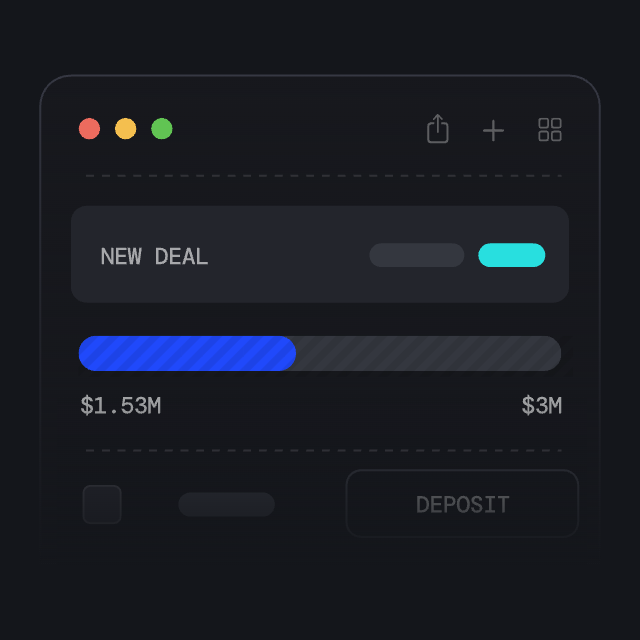
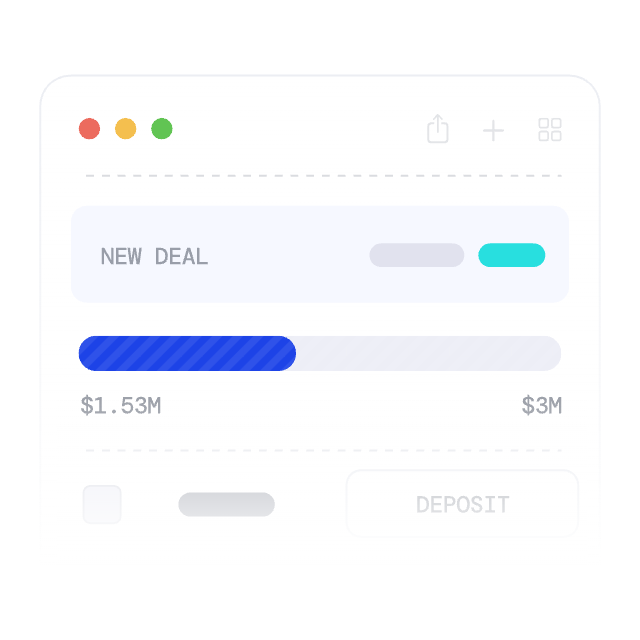
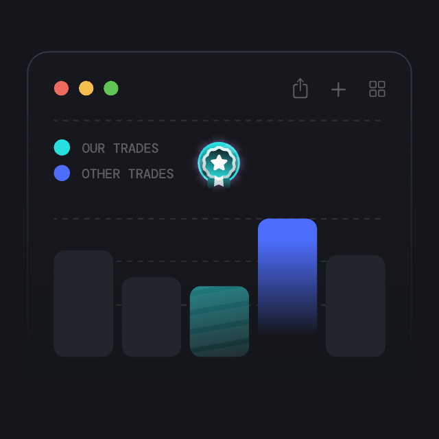
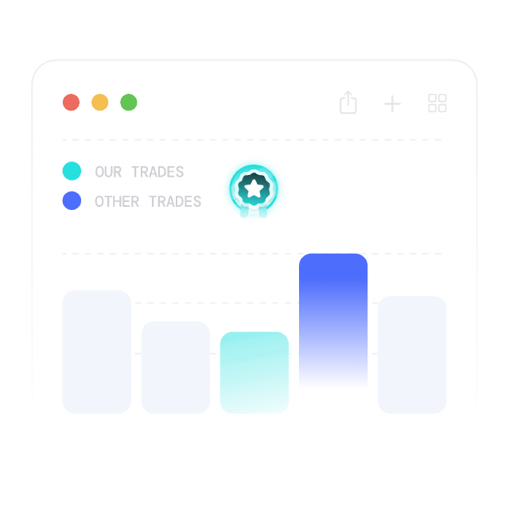

# Lottie Theme Studio

Turn a dark-theme Lottie animation into a light one (or the other way round) without
After Effects — with visual colour identification, an auto-proposed opposite theme and
batch processing.

**[lottie.italik.dev](https://lottie.italik.dev)** — the editor runs entirely in your
browser. Your files are never uploaded and there is no account to make.

It exists because the source file is usually gone, the exporter scattered colour across
eight different shapes of JSON, and "invert the lightness" produces washed-out grey and
dark halos on a white page.

> The browser is the whole product, but it is not the whole tool. Clone the repository,
> open it with an AI agent, and the agent gets the same core through an MCP server plus
> the two things the page cannot give it: it can *look* at what it rendered, and it can
> reach the colours no palette shows — bitmaps baked into the file, the colour on a drop
> shadow. See [Working with an agent](#working-with-an-agent).

## Before and after

| dark, as it shipped | light, converted here |
| --- | --- |
|  |  |
|  |  |

Both started from `suggest_theme` and neither was finished by it. The progress bar carries
a striped PNG baked into the file — invisible on a dark page, a grey hatch spilling past
the rounded track on a white one — and the badge's glow is a colour on a Drop Shadow
effect, which no palette lists. Rendering the result is how both were found.

## Layout

```
packages/core   @lottie-theme/core — all the logic, no UI dependencies
packages/cli    lottie-theme — the same logic on the command line, for CI and batches
packages/mcp    an MCP server, so an AI agent edits through the same core
packages/sync   the live bridge between the editor and a local agent (development only)
apps/web        Next.js app (App Router, Tailwind, shadcn/ui, Zustand, lottie-web)
tools/colors.py the original Python proof of concept, kept as the parity reference
lotties/        the corpus this was built against — not part of the repository
scripts/        headless smoke test of the editor
```

The web app, the CLI and the MCP server are thin shells over `core`. Nothing
about how a colour is found or changed is implemented twice, so an animation edited by
hand and one edited by a script come out the same.

## Running it

```bash
pnpm install
pnpm dev          # http://localhost:3000
pnpm sync         # live bridge to a local agent, optional — see below
pnpm test         # core unit tests + parity against tools/colors.py
pnpm typecheck
pnpm smoke        # headless browser check; needs `pnpm dev` running
```

`pnpm smoke` drives the running app through the system Chrome and checks the things unit
tests cannot: that lottie-web mounts an SVG, that a palette edit reaches the canvas, that
dragging a gradient stop reaches the rendered SVG, and that undo restores it. Pass a base
URL if dev picked another port: `pnpm smoke http://localhost:3001`.

The tests that walk `lotties/` skip themselves when that folder is not there, so a fresh
clone is green without it. `pnpm smoke` and `pnpm dev`'s file list need animations of your
own: drop them into `lotties/` or straight onto the page.

## Command line

```bash
lottie-theme report lotties/**/*.json          # colours in each file
lottie-theme list animation.json               # every slot, with its index
lottie-theme apply in.json out.json '#17181D=#FFFFFF' 12=f0f
lottie-theme suggest in.json out.json --save-theme theme.json
lottie-theme batch lotties/ light/ --theme theme.json
```

`--embed` writes the edit set into the output under `meta.themeStudio`; players ignore
fields they do not know, so the file keeps working while carrying its own colour map.
`--use-embedded` reads it back. `--reference <file>` refuses to apply position-addressed
edits to a document whose slot structure differs, falling back to the by-hex parts.

## Working with an agent

The editor is complete on its own. An agent is what makes the *rest* of a file reachable:
it can look at the render it just produced, and it can change the colours that no palette
lists — a striped PNG baked into the animation, the colour on a Drop Shadow effect.

### In the browser, with your own key

The `agent` tab takes your own Anthropic API key and works on the open animation by
description — "make a light version and check it on white", "the glow around the badge
still looks dark, fix just that". Requests go from the page straight to the provider;
there is no backend here to route them through, which is the same reason your files never
leave the browser. The key is stored in that browser and nowhere else, and the editor
shows a running cost estimate since it is billed to your account.

The agent has the same operations you do — palette, slots, layer tree, theme suggestion,
apply — plus `look_at_canvas`, which hands it a picture of the current render. That one
matters: a gradient fading into the backdrop reads as correct in the JSON and wrong on
the page. Its edits land in the same undo stack as yours.

### Locally, which is where it gets good

Clone the repository, open it with an MCP-capable agent (Claude Code needs no setup —
`.mcp.json` points at the local server and the `lottie-theming` skill carries the
workflow), and ask for what you want in a sentence. Point it at your reference screenshot
and it will sample the pixels rather than guess a hex, convert the folder, and check its
own work by rendering it.

What the local agent can do that the page cannot:

- **See its own render.** `render_preview` hands it a PNG on the background the animation
  will actually sit on. A gradient fading into the backdrop reads as correct in the JSON
  and shows up as a dark halo on the page; nothing but looking catches it.
- **Recolour embedded bitmaps.** A quarter of real files carry a PNG, and it is dark like
  everything else. `recolor_image` moves its pixels towards the colours you asked for and
  never touches alpha, so a bitmap that doubles as a matte keeps working.
- **Reach effect colours.** A Drop Shadow carries its own colour outside the shape tree.
  `list_effects` is the only place it shows up at all.
- **Sample a reference instead of guessing.** `sample_screenshot` reads the exact colours
  an image contains, and `verify` takes your planned edit set and reports how far each
  resulting colour lands from the reference — a near-miss caught as a number, before
  anything is written.
- **Do the whole folder**, with the same edit set, in one pass.

### The MCP server

Point any MCP-capable agent at the server and it edits the same files through the same
core a person does:

```jsonc
// .mcp.json
{ "mcpServers": { "lottie-theme": { "command": "npx", "args": ["-y", "lottie-theme-mcp"] } } }
```

`CLAUDE.md` explains the project and the `lottie-theming` skill carries the workflow and
the traps — gradients that fade into the backdrop, values shared through a reused precomp,
embedded bitmaps, a colour that lives on an effect — so an agent starts with what took this
project a corpus of 53 files to learn.

| tool | what it is for |
| --- | --- |
| `read_palette` | every colour with usage counts, and any edit set saved in the file. Start here. |
| `list_slots` | individual colour slots, filtered by hex or kind |
| `layer_tree` | the document as layers, three levels deep by default |
| `list_gradients` | each gradient whole: stops, positions, alpha ramp, and whether it fades out |
| `list_effects` | colours carried by effects — a drop shadow's own colour |
| `suggest_theme` | the opposite theme as a draft, with a WCAG audit |
| `sample_screenshot` | exact colours of a reference image; `snap` and `verify` check yours against it |
| `recolor_image` | embedded bitmaps: what they are made of, and recolouring them |
| `apply_edits` | apply an edit set and write the file |
| `render_preview` | render it and look |
| `session_state`, `push_edits` | the live bridge to an open editor |

Results are deliberately small — a whole-file dump used to cost twenty thousand tokens a
call. The full form of each is behind a flag (`depth`, `describe`, `explain`, `slots`).

`render_preview` is the one that matters. Without seeing the result of its own edit an
agent works blind, and blind is exactly where gradient masks go wrong — a ramp that fades
into the backdrop looks correct in the JSON and wrong on the page. It renders through the
system Chrome, reused across calls; set `LOTTIE_THEME_CHROME` if it is somewhere unusual.

Every path is confined to the working directory: an agent cannot read or overwrite files
elsewhere because something told it to.

### Agent and editor on the same thing

Run the bridge in the folder you are working in and the browser and the agent stop being
two views of the same file that have to be reconciled by hand:

```bash
npx lottie-theme-sync        # in the same folder your agent's MCP server runs in
pnpm dev                     # the editor picks the bridge up on its own
```

The `sync` tab then shows the connection, everything either of you has changed, and who
changed it. What travels between them is the *edit set*, never the animation — so an
agent's change arrives in the browser the way a click does, lands in the same undo stack,
and can be rejected with `revert` on that one step.

- The agent sees the file you have open, the colour you have selected and the slot indices
  behind it (`session_state`), which is what makes "make *this* one white" a sentence it
  can act on.
- It can propose a change you watch appear (`push_edits`) instead of writing the file and
  asking you to reload; `apply_edits` still writes, and the editor updates as it does.
- Nothing is written to disk until you press **write changes to the file**. Autosave would
  rewrite your sources while you experiment, and it would buy nothing: the agent already
  sees your unsaved work through the session.
- If a file changes underneath the editor — you edited the JSON by hand, an agent wrote it
  directly — the editor says so and offers to reload rather than quietly diverging.

The bridge binds to loopback and exists only in development. The shipped build has no
socket to open: it is static files, and your animation still never leaves the browser.

## How Lottie stores colour

Poorly documented elsewhere, so, briefly — `@lottie-theme/core` addresses all of it:

| where | shape | notes |
| --- | --- | --- |
| solid fill / stroke | `fl` / `st` → `c.k` | three numbers, 0..1 |
| animated fill / stroke | `c.k[i].s` and `.e` | one colour per keyframe end |
| gradient | `gf` / `gs` → `g.k.k` | flat array: `p` colour stops of `pos,r,g,b`… |
| gradient alpha ramp | same array, after `p * 4` | pairs of `pos,alpha` — without these a gradient cannot be read correctly |
| animated gradient | `g.k.k[i].s` | the whole ramp is keyframed |
| solid layer | layer `ty:1` → `sc` | a `#rrggbb` **string**, outside the shape tree |
| text | `t.d.k[i].s.fc` / `.sc` | separate from `fl`; often converted to paths on export |
| effect colour | layer `ef[].ef[]` with `ty:2` → `v.k` | a Drop Shadow's own colour; no palette built from fills and strokes will ever show it |
| raster image | `assets[].p` | a data URI when embedded; dark bitmaps are why a converted file still has dark patches |

A colour slot is addressed by a serialisable path plus an offset, and slots are numbered in
layer z-order (`layers` → `assets` recursively). That ordering is the contract that keeps
slot indices stable, so a saved colour map still applies after a re-import. `packages/core/test/parity.test.ts`
locks it against the Python PoC over the whole corpus.

## Not done yet

Deliberately, and in roughly this order:

- **Selecting on the canvas should select in the layer tree.** Clicking a shape fills the
  slot panel, but the layer tree does not move to it or expand to reveal it. The two views
  should stay in step in both directions, including scrolling the row into view.
- **Shadows should be first-class in the editor.** Effect colours are reachable from the
  core, the CLI and the MCP server, but the browser cannot see or edit them — they are
  addressed by path and the editor's palette is built from slots. A shadow needs to appear
  as an ordinary colour, with its own opacity, next to everything else.
- **Re-check `sync` and `agent` end to end.** Both were built early and have not been
  exercised since the gradient, effect and bitmap work landed. The live bridge in
  particular carries an edit set that has grown three new fields.
- Adding and removing gradient stops (positions and colours move today; the count is
  fixed).
- `packages/sync`'s hub test is timing-sensitive: it watches a file and waits a second for
  the event, and it fails under load. It wants a deterministic clock, not a longer wait.
- A published npm build of `@lottie-theme/core`, which is consumed as TypeScript source.

## Deployment

The editor is a static Next.js app with no backend of its own. On Vercel, point the
project at this repository — the build command and output directory are in
`vercel.json`, and no environment variables are needed. The dev-only bridge to a local
`lotties/` folder (`app/api/local/route.dev.ts`) is excluded from production builds by
`pageExtensions`, which is what keeps the shipped app a pile of static files.

## Credits

Built by [italik.dev](https://www.italik.dev/). Source at
[github.com/ITalik-gr/lottie-theme](https://github.com/ITalik-gr/lottie-theme).

## Licence

MIT.
